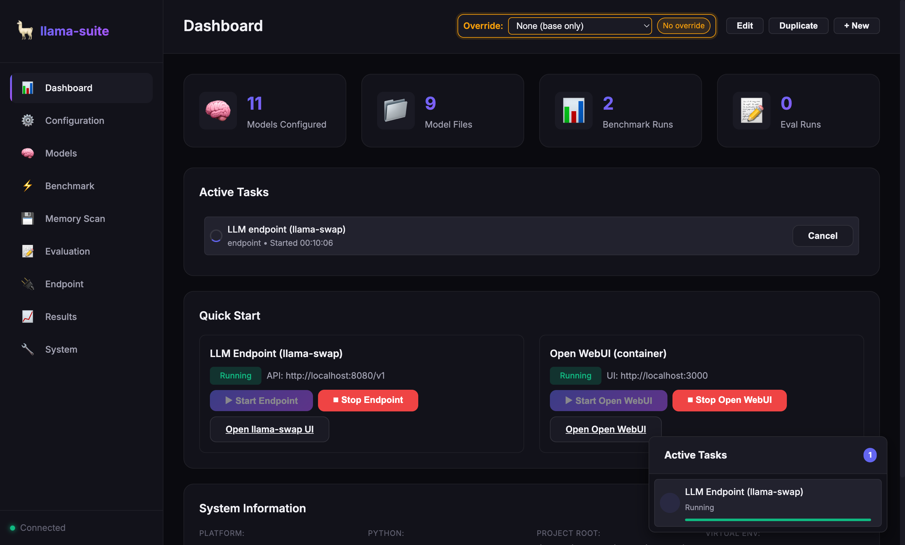
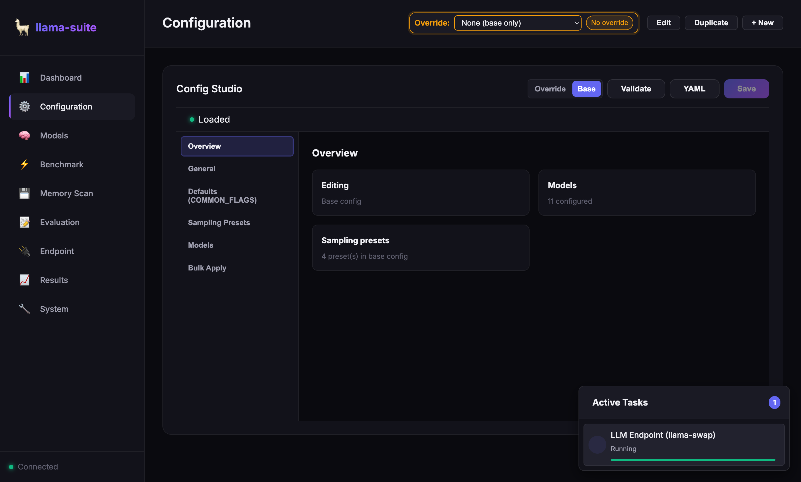
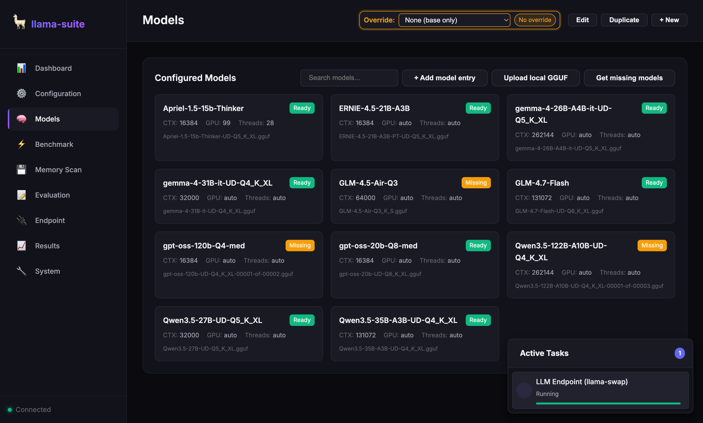
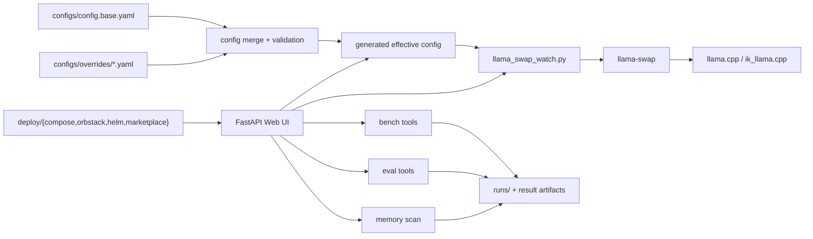

# llama-suite

[](https://github.com/FlorianZimmer/llama-suite/actions/workflows/ci.yml)

[](LICENSE)

`llama-suite` is a config-driven local LLM operations toolkit built around `llama.cpp` and `llama-swap`.
It keeps machine-specific model configuration, runtime control, evaluation, benchmarking, and deployment packaging in one repo instead of scattering them across shell scripts, local notes, and one-off containers.

## Why

Running local models across multiple machines gets messy fast:

- one base config drifts into several hand-edited variants
- runtime launch scripts and eval scripts stop agreeing on ports or model names
- UI controls, deployment packaging, and benchmark outputs live in different places

`llama-suite` exists to make that workflow reproducible. The repo treats local LLM ops as a system, not just a server binary.

## How

1. Define the shared baseline in `configs/config.base.yaml`.
2. Layer machine-specific overrides from `configs/overrides/`.
3. Generate an effective runtime config for `llama-swap` and `llama.cpp`-compatible backends.
4. Use the FastAPI Web UI to inspect config, launch endpoints, run sweeps, benchmarks, memory scans, and evals.
5. Package the same control plane for local containers, OrbStack, Compose, Helm, and marketplace-style deployment.

## What's Different

- It is ops-first, not SDK-first. The main artifact is a working local control plane.
- Config overrides are first-class, so one repo can drive macOS, Windows, and larger workstation setups.
- The Web UI is connected to real local tasks: endpoint lifecycle, config editing, download flows, sweeps, and results.
- Deployment packaging lives next to the runtime and eval tooling, so local experimentation and hosted control surfaces stay aligned.

## Screenshots

**Dashboard**



The dashboard shows active endpoint tasks, Open WebUI controls, system state, and the currently selected machine override.

**Config Studio**



Config Studio exposes the merged config model instead of raw YAML only, which makes override editing and validation much faster.

**Model Inventory**



The models view surfaces readiness, context size, GPU/thread settings, and missing artifacts from the same source of truth used by the runtime.

## Architecture



## Core Capabilities

- Launch and restart `llama-swap` from merged base plus override config.
- Expose a local Web UI for config inspection, endpoint control, model management, and results.
- Run benchmark, evaluation, sweep, and memory-scan tasks against the same configured model inventory.
- Support Open WebUI lifecycle management alongside the endpoint layer.
- Package the Web UI for Docker/Compose, OrbStack, Helm, and marketplace-style deployment.

## Quick Start

Use Python 3.10+.

macOS/Linux:

```bash
python tools/scripts/install.py --dev-extras
./.venv/bin/python -m llama_suite.webui.server
```

Windows PowerShell:

```powershell
python tools\scripts\install.py --dev-extras
.\.venv\Scripts\python.exe -m llama_suite.webui.server
```

The Web UI serves on `http://localhost:8088`.

## Common Commands

Install or refresh the repo environment:

```bash
python tools/scripts/install.py --dev-extras
./.venv/bin/python tools/scripts/update.py --dev-extras
```

Run the watcher with a machine override:

```bash
./.venv/bin/python -m llama_suite.watchers.llama_swap_watch -o configs/overrides/mac-m3-max-36G.yaml
```

Run the OpenCode proxy in front of llama-swap:

```bash
./.venv/bin/python -m llama_suite.proxy.opencode \
  --host 127.0.0.1 \
  --port 8081 \
  --upstream http://127.0.0.1:8080/v1 \
  --slots 1 \
  --cache-reuse 256
```

Point OpenCode at `http://127.0.0.1:8081/v1`. The proxy injects llama.cpp prompt-cache controls and stable slot affinity so repeated OpenCode system/tool prefixes can reuse KV cache.

Run tests:

```bash
./.venv/bin/python -m pytest -q
```

## Deployment

- [deploy/orbstack/README.md](deploy/orbstack/README.md): local macOS container deployment.
- [deploy/charts/llama-suite-webui/README.md](deploy/charts/llama-suite-webui/README.md): Helm chart for the Web UI.
- [deploy/marketplace/llama-suite-webui/README.md](deploy/marketplace/llama-suite-webui/README.md): marketplace packaging.

## Release Hygiene

- Changelog: [CHANGELOG.md](CHANGELOG.md)
- Release playbook: [docs/releasing.md](docs/releasing.md)

## Notes

- `models/`, `runs/`, `var/`, and generated configs are intentionally local and ignored.
- The repo vendors only the pieces needed to support local runtime workflows.
- The Web UI package includes its static assets and schema when built from this repo.
